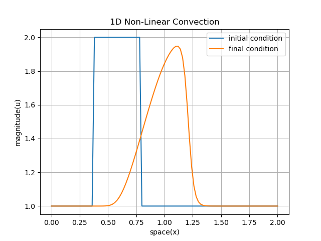

# scicpp
*A scientific coding standard and library for writing clear,concise and expressive C++ scientific applications.*

### Author   : Sayan Bhattacharjee
### Email    : aero.sayan@gmail.com
### LinkedIn : www.linkedin.com/in/aerosayan

### DISCLAIMER :
 This is the intellectual property of the author Sayan Bhattacharjee.
 Currently this is not being distributed since development is incomplete.
 In future, proper licensing will be done and this coding standard and 
 library will be made Open-Source.
 We do not give any guarantee for the correct operation of the library, 
 neither are we to be held responsible for any kind of damage caused by the 
 use of this software.

 Thank you for your understanding, support and patience.


### INTRODUCTION
C++ has no standards and guidelines for creating and maintaining large codebases for scientific applications.
FORTRAN is considered to be the best for High Performance scinentific applications for a reason.
Similarly Python and Numpy have also gained attention of scientific community for Machine Learning applications.
In both FORTRAN and Python/Numpy we are able to write very clear, concise and expressive code and hence they are heavily used.<br>

*In scicpp, we shall try to emulate the best of both FORTRAN and C/C++.*


### FILES AND FOLDERS
scicpp
+ img/ : Contains the images generated.
+ scicpp.hpp : This is the file which is to be included in your project.
+ main.cpp : Tests to show the operation and usefulness of scicpp.


### COMPILATION AND TEST

```
$ cd scicpp
$ g++ -std=c++11 -O2 main.cpp -o test_scicpp
$ ./test_scicpp.exe
$ python visualize_nonlinear_convection.py
```
### RESULT
By compiling main.cpp and running test_scicpp executable we generated 
two files input.dat and output.dat which contains the data for the begining and
end of the nonlinear convection simulation, done using scicpp.

We then call visualize_nonlinear_convection.py to visualize the following result.
The code in main.cpp will show exactly to any scientific scholar how it is done and it will be clearly understandable why scicpp is needed.

| |
|:--:|
| *1D Non-Linear Convection simulation done in C++ using scicpp guideline and library* |


### USER EXAMPLE
This is a snippet of code from the 1D Non-Linear Convection test in main.cpp. <br>
For any scientific scholar it should be perfectly clear that we are able to do 
FORTRAN like operations in C++ and hence the code is more clear,concise and expressive.
```

// Solves the 1D nonliner convection equation using Finite Difference Method
// 1D nonlinear convection equation is :
// 
//                     d(u)/dt + u*d(u)/dx = 0
//
// where,
// u is the dependent variable.
// d(u)/dt is the partial derivative of u w.r.t time(t)
// d(u)/dx is the partial derivative of u w.r.t space(x)
// 
// We shall be using FTBS( Forward in Time Backward in Space) scheme to solve.
void run_nonlinear_convection_test()
{
  // No. of spatial nodes
  u32 nx = 101;
  // No. of temporal iterations
  u32 nt = 200;
  // Minimum and maximum space domain which will be discretized
  f64 min_x = 0.0; f64 max_x = 2.0;
  // Spatial discretization 
  f64 dx = (max_x-min_x)/(nx-1);
  // Temporal discretization
  f64 dt = 0.0015;

  // Spatial mesh
  VEC(f64) x(nx+1);
  DO(i,1,nx)
    x[i] = min_x + (dx*(i-1));
  ENDDO
  //DBGARR(x);

  // Dependent variable to simulate and solve
  // un is u at time n
  // un1 is u at time n+1
  VEC(f64) un(nx+1),un1(nx+1);

  // Set initial conditions
  DO(i,1,nx)
    un1[i] = 1.0;
  ENDDO
  // We shall be using a  hat function for intial condition
  DO(i,20,40)
    un1[i] = 2.0;
  ENDDO

  // Write input to file input.dat
  ofstream input_file;
  input_file.open("input.dat",ios::out);

  IF(input_file.is_open())
    DO(i,1,nx)
      input_file<<x[i]<<"\t"<<un1[i]<<"\n";
    ENDDO
  ELSE
    cout<<"ERROR :: INPUT FILE NOT OPENED CORRECTLY"<<endl;
  ENDIF

  // Start temporal iterations
  DO(t,1,nt)
    un = un1;
    DO(i,2,nx)
      un1[i] = un[i] - un[i]*dt/dx*(un[i]-un[i-1]);
    ENDDO
  ENDDO

  // Write output to file output.dat
  ofstream output_file;
  output_file.open("output.dat",ios::out);

  IF(output_file.is_open())
    DO(i,1,nx)
      output_file<<x[i]<<"\t"<<un1[i]<<"\n";
    ENDDO
  ELSE
    cout<<"ERROR :: OUTPUT FILE NOT OPENED CORRECTLY"<<endl;
  ENDIF

  // Close all open files
  input_file.close();
  output_file.close();
}
```